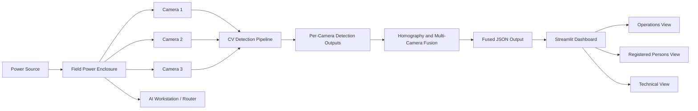

# Real-Time Passenger Counting and Monitoring System for CAG - Project Plan

## 1. Project Summary

This project is a multi-camera passenger counting and monitoring system designed for a controlled evacuation-like scenario in a tent environment for Changi Airport Group (CAG).

The system detects people from multiple camera feeds, combines the results into one fused count, and displays the operational state through a real-time dashboard. The dashboard is built as a Streamlit application and is responsible for showing the count, capacity status, camera/system health, zone occupancy, alerts, logs, and an optional registered-person presence display.

The current repository focuses mainly on the dashboard and integration layer. The computer vision and multi-camera fusion outputs are expected to be produced by teammates and consumed by the dashboard through a shared JSON data contract.

## 2. Project Title

Official project title:

**Real-Time Passenger Counting and Monitoring System for CAG**

Suggested dashboard display title:

**CAG Passenger Monitoring - Live Dashboard**

Reason:

The official title is suitable for the report, contract, and presentation. The shorter dashboard title is easier to read during a live demo.

## 3. Problem Statement

During evacuation-like or high-density crowd scenarios, manually counting passengers can be slow, manpower-intensive, and prone to human error. In a tent or temporary field setup, visibility may be limited, people may move between zones, and staff may need quick information about occupancy and system reliability.

This project aims to support monitoring by using multiple cameras and computer vision to estimate passenger counts in real time, then presenting the information in a clear dashboard that helps operators understand:

- how many people are currently inside the monitored area
- whether occupancy is within safe limits
- which zones are more crowded
- whether cameras and fusion components are working
- whether alerts or system faults require attention

## 4. Main Objectives

1. Build a multi-camera people counting system for a tent-based evacuation-like scenario.
2. Collect and process camera data suitable for people detection and counting.
3. Train, tune, or optimise a YOLO-based people detection pipeline.
4. Fuse multi-camera outputs using homography or spatial mapping to reduce duplicate counting.
5. Display the fused count and operational status in a Streamlit dashboard.
6. Show zone-level occupancy, camera health, alerts, logs, and capacity status clearly.
7. Support field deployment planning, including a practical waterproof power enclosure.
8. Add an optional registered-person presence display for consented test participants only.
9. Add evacuation-focused monitoring concepts such as trend direction, critical-state timer, and estimated time to capacity when count history is available.
10. Optionally surface higher-level CV outputs such as camera visibility, aggregated age-group counts, or possible assistance-needed indicators only if the CV pipeline provides them and approval is given.
11. Document the system architecture, test results, risks, and limitations for final presentation.

## 5. Team Responsibilities

| Team Member | Main Ownership | Outputs Needed By Dashboard |
|---|---|---|
| Mikail | Camera setup, data collection, YOLO training, model optimisation | Camera IDs, camera status, FPS, per-camera counts, processed frames or snapshots |
| Haoran | Multi-camera fusion, homography, spatial mapping | Fused total count, zone counts, duplicate handling, fused person/location outputs |
| You | UI/dashboard, JSON integration, monitoring display, power enclosure support, documentation | Streamlit dashboard, data contract, visualisation, logs, demo scenarios, UI screenshots |

The dashboard should remain independent from the heavy computer vision model. It should display processed outputs, not run YOLO, face recognition, age estimation, injury detection, or low-light analysis directly.

## 6. High-Level Architecture



The dashboard receives a processed JSON output from the CV/fusion side. The JSON can first be a static demo file, then a live-updating file, and later an API or socket if the team needs stronger real-time performance.

## 7. Runtime Data Flow

1. Cameras capture video from different angles inside the tent.
2. Mikail's CV pipeline detects people in each camera feed.
3. Per-camera detections are sent to Haoran's fusion logic.
4. Haoran's fusion module maps detections into a shared coordinate or zone system.
5. Duplicate detections across cameras are reduced.
6. The fusion module writes a dashboard-ready JSON file.
7. The Streamlit dashboard reads the JSON file repeatedly.
8. The dashboard updates the count, status, alerts, floorplan, system health, and logs.

Current dashboard input method:

```text
data/sample_fusion_output.json
```

Recommended live integration method:

```text
fusion_pipeline.py writes -> data/live_fusion_output.json
dashboard reads -> data/live_fusion_output.json
```

## 8. Current Repository Structure

```text
.
|-- app.py
|-- cag_dashboard/
|   |-- app_shell.py
|   |-- components.py
|   |-- config.py
|   |-- controls.py
|   |-- data.py
|   |-- logic.py
|   |-- styles.py
|   |-- theme.py
|   `-- views/
|       |-- cameras.py
|       |-- floorplan.py
|       |-- header.py
|       |-- health.py
|       |-- overview.py
|       |-- people.py
|       `-- technical.py
|-- data/
|   |-- sample_fusion_output.json
|   `-- scenarios/
|       |-- 01_normal_operation.json
|       |-- 02_warning_near_capacity.json
|       |-- 03_critical_over_capacity.json
|       |-- 04_camera_offline.json
|       |-- 05_registered_persons.json
|       `-- 06_fusion_system_offline.json
|-- tools/
|   |-- hikvision_yolo_stream.py
|   `-- mock_stitched_feed.py
|-- README.md
|-- plan.md
|-- requirements.txt
|-- requirements-camera.txt
`-- style.md
```

## 9. Current Dashboard Components

| Component | File / Function | Purpose |
|---|---|---|
| Streamlit entry point | `app.py` | Thin launcher that calls the dashboard shell |
| Dashboard shell | `cag_dashboard/app_shell.py` | Page orchestration, tabs, settings, refresh loop, and view placement |
| Config | `cag_dashboard/config.py` | Paths, demo scenarios, thresholds, status colours, theme palettes |
| Settings controls | `cag_dashboard/controls.py` | Top-right settings panel for data source, stitched feed URL, runtime, and thresholds |
| Data loader | `cag_dashboard/data.py` | Reads JSON safely and applies default empty lists |
| Dashboard logic | `cag_dashboard/logic.py` | Data age, capacity state, trend, ETA, alerts, camera and zone calculations |
| Styling | `cag_dashboard/styles.py` and `cag_dashboard/theme.py` | CSS injection, light/dark mode, and visual theme state |
| Shared components | `cag_dashboard/components.py` | Badges, theme button, and custom light tables |
| Header view | `cag_dashboard/views/header.py` | Dashboard title and status metadata row |
| Operations overview | `cag_dashboard/views/overview.py` | Total count, capacity, operational brief, and alert strip |
| Tent floorplan | `cag_dashboard/views/floorplan.py` | Dynamic SVG zone heatmap from `zones`, top-level `capacity_limit`, and optional `zones[].zone_capacity` |
| Camera views | `cag_dashboard/views/cameras.py` | Live stitched feed panel and compact camera status tiles |
| Health and events | `cag_dashboard/views/health.py` | Count-over-time chart, system health, and latest events |
| Registered persons | `cag_dashboard/views/people.py` | Optional consented registered-person display |
| Technical view | `cag_dashboard/views/technical.py` | Raw JSON and debug tables |
| Demo scenarios | `data/scenarios/` | Test cases for normal, warning, critical, camera offline, registered persons, and fusion offline |

## 10. Dashboard Views

Style source of truth:

Dashboard layout and visual styling decisions are tracked in `style.md`. Update `style.md` whenever the dashboard's first-screen layout, visual tone, main priority, or major monitoring components change. This plan should stay focused on project scope, architecture, integration, and testing.

### 10.1 Operations Overview

Main audience:

- CAG operations staff
- supervisors
- demo evaluators

Purpose:

Show the most important live information quickly.

Current content:

- total fused passenger count
- capacity used percentage
- capacity status
- current alert banner
- registered-person summary
- camera snapshot placeholder cards
- dynamic tent zone floorplan
- count-over-time chart
- system health summary

This view should stay clean and not show raw JSON by default.

Planned evacuation-focused additions:

- count trend indicator beside the total count: rising, stable, or falling
- critical-state timer showing how long the system has been in critical capacity
- estimated time to capacity using recent `count_history`
- zone delta indicators showing recent count changes when previous zone snapshots are available
- confidence-weighted count note when camera health makes the fused count less reliable

### 10.2 Registered Persons

Main audience:

- technical evaluators
- project supervisors
- demo team

Purpose:

Display optional face-recognition output from the CV pipeline for consented test participants.

The dashboard does not perform recognition. It only displays processed results such as:

- person ID
- anonymised label
- presence status
- last seen time
- camera source
- confidence score

This feature is a nice-to-have extension and should not delay the core passenger counting dashboard.

### 10.3 Technical View

Main audience:

- project team
- debugging during integration

Purpose:

Show lower-level details that help the team verify data flow.

Current content:

- camera status table
- zone count details
- alert list
- event log
- expected schema
- raw JSON

This view is hidden by default behind the top-right settings toggle **Show technical tools** because it is not ideal for an operations-focused CAG demo.

## 11. JSON Data Contract

The dashboard expects a JSON object with the following top-level fields.

For backward compatibility, existing demo files without `schema_version` should be treated as schema version `"1.0"`.

| Field | Type | Purpose |
|---|---|---|
| `schema_version` | string | Dashboard data contract version, defaulting to `"1.0"` |
| `timestamp` | string | Latest output time in ISO format |
| `run_id` | string | Current test or demo run identifier |
| `total_count` | integer | Final fused passenger count |
| `capacity_limit` | integer | Maximum planned tent capacity |
| `status` | string | Overall status such as `normal`, `warning`, `critical`, or `offline` |
| `system_health` | object | Fusion, power, and network state |
| `zones` | list | Zone-level counts after fusion |
| `cameras` | list | Camera status, FPS, and per-camera counts |
| `recognized_persons` | list | Optional registered-person presence data |
| `alerts` | list | Current important alerts |
| `event_log` | list | Historical events for debugging and report evidence |
| `count_history` | list | Count trend entries with `timestamp` and cumulative fused `total_count` |

Example:

```json
{
  "schema_version": "1.0",
  "timestamp": "2026-05-13T14:05:30+08:00",
  "run_id": "field_test_001",
  "total_count": 128,
  "capacity_limit": 150,
  "status": "critical",
  "system_health": {
    "fusion_engine": "Online",
    "power": "Normal",
    "network": "Online"
  },
  "zones": [
    {
      "zone_id": "A",
      "count": 42
    }
  ],
  "cameras": [
    {
      "camera_id": "cam_1",
      "status": "online",
      "count": 39,
      "fps": 12.5
    }
  ],
  "recognized_persons": [],
  "alerts": [],
  "event_log": [],
  "count_history": [
    {
      "timestamp": "2026-05-13T14:01:00+08:00",
      "total_count": 82
    },
    {
      "timestamp": "2026-05-13T14:05:00+08:00",
      "total_count": 128
    }
  ]
}
```

`count_history` rules:

- Each entry should use `{"timestamp": "...", "total_count": integer}`.
- ISO timestamps with timezone are preferred, for example `2026-05-13T14:05:00+08:00`.
- Short `HH:MM` timestamps are accepted for demo data, but the dashboard must convert them to minutes from session start before using them for trend or ETA calculations.
- `total_count` is the fused cumulative people count at that timestamp, not the number of people added during that interval.
- Malformed or missing timestamps should disable trend/ETA output gracefully instead of crashing the dashboard.

### 11.1 Optional JSON Extensions

The dashboard must continue working if these fields are missing. They are optional extensions for future integration and should only be displayed when the CV/fusion side provides them.

| Optional Field | Location | Type | Purpose |
|---|---|---|---|
| `zone_capacity` | `zones[]` | integer | Per-zone capacity when zone sizes are not equal |
| `visibility_status` | `cameras[]` | string | Camera visibility state such as `normal`, `low_light`, `obstructed`, or `unknown` |
| `visibility_score` | `cameras[]` | number | Optional 0 to 1 quality score for lighting/visibility |
| `age_group_counts` | top level or `zones[]` | object | Aggregated age-group estimates only if approved and provided by CV |
| `assistance_needed_count` | top level or `zones[]` | integer | Aggregated count of possible assistance-needed cases, not individual diagnosis |
| `power_details` | `system_health` | object | Optional voltage, battery, generator, or power draw information if hardware supports it |

Rules for optional CV attributes:

- Do not display individual-level age, injury, or medical labels.
- Use aggregate wording such as "possible assistance needed" rather than confirmed injury.
- Treat these as advisory CV outputs, not dashboard decisions.
- Hide these fields if supervisor/CAG approval is not given.
- Record low-light or poor visibility as a reliability factor, not as a passenger attribute.

## 12. Live JSON Update Strategy

The dashboard can be made live by having the fusion pipeline continuously update a JSON file that the dashboard reads.

Recommended file:

```text
data/live_fusion_output.json
```

Recommended update rate:

```text
1 to 2 seconds
```

Recommended producer behaviour:

1. CV/fusion pipeline computes latest output.
2. Pipeline creates a complete JSON object using the agreed schema.
3. Pipeline writes to a temporary file first.
4. Pipeline renames or replaces the temporary file as `live_fusion_output.json`.
5. Dashboard reads only complete JSON files.

Why this matters:

If the pipeline writes directly into the same JSON file while Streamlit is reading it, the dashboard may catch the file halfway through writing and show a JSON error. Writing to a temporary file first reduces this risk.

Example live handoff:

```text
data/live_fusion_output.tmp.json
data/live_fusion_output.json
```

Ask from Haoran and Mikail:

- exact file path for the live output
- agreed `schema_version`
- update frequency
- whether timestamp uses Singapore time with timezone
- whether zone counts are final fused values
- whether per-camera counts are raw or post-processed
- what camera IDs will be called
- what happens if one camera is offline

## 12.1 Live Stitched Camera Feed

The dashboard can also display a stitched camera feed produced by the camera/CV side. The dashboard should not stitch camera frames itself; it should embed a stream URL exposed by the stitching pipeline.

Recommended first live stream:

```text
http://localhost:8080/stitched_feed
```

Recommended producer behaviour:

1. Camera pipeline captures frames from each camera.
2. Stitching module combines frames into one monitoring view.
3. Stitching server exposes the combined view as an HTTP stream.
4. Dashboard reads the stream URL from the top-right settings panel.
5. Dashboard places the stitched feed beside the floorplan and above camera status tiles.

For an OpenCV prototype, an MJPEG stream from Flask or FastAPI is the simplest option. If the team later uses WebRTC, HLS, or a separate browser player, the same dashboard location should be reused, but the embed method may need to change.

## 13. Threshold And Status Rules

The dashboard currently uses these default capacity thresholds:

| Range | State | Display Colour |
|---|---|---|
| below 60% | Normal | Green |
| 60% to 85% | Warning | Amber |
| above 85% | Critical | Red |

These defaults should be configurable through the dashboard settings panel or a config file before field trials, so CAG or the project supervisor can adjust them without editing source code.

These thresholds are used for:

- total capacity status
- alert priority
- occupancy bar colour
- zone floorplan heat overlay

Status precedence:

1. If the data is stale, missing, or the fusion engine is explicitly offline, the dashboard displays `offline`.
2. Otherwise, the dashboard calculates capacity state from `total_count / capacity_limit`.
3. The fusion-provided `status` is still read, but the final displayed status uses the more severe of the fusion status and calculated capacity state.
4. Severity order is `normal < warning < critical < offline`.

This prevents contradictions such as the fusion JSON saying `warning` while the count has already crossed the dashboard's critical threshold.

## 14. Dynamic Floorplan Design

The tent floorplan is rendered as an SVG in `cag_dashboard/views/floorplan.py`.

Inputs:

```python
render_floorplan(data, deltas)
```

The current floorplan does not require new JSON fields. It uses:

- `zones`
- `capacity_limit`

Current fallback behaviour:

```text
zone_capacity = capacity_limit / number_of_zones
```

This means the component works for 2, 3, 4, or more zones without hardcoding individual zone capacities.

Future enhancement:

If Haoran provides `zones[].zone_capacity`, the floorplan should use that per-zone value instead of dividing the total capacity evenly. This avoids the unrealistic assumption that every zone in the tent has the same size and safe occupancy, while avoiding a naming collision with the top-level `capacity_limit`.

Each zone displays:

- zone label
- current count
- zone capacity
- percentage used
- occupancy state

### 14.1 Evacuation Monitoring Layer

The evacuation-monitoring layer should make the dashboard more useful during a fast-changing evacuation-like scenario, where the direction and speed of change matter as much as the current count.

Planned features:

| Feature | Input | Dashboard Behaviour |
|---|---|---|
| Trend direction | Last 2 to 3 `count_history` entries | Show rising, stable, or falling beside total count |
| Critical timer | First timestamp where capacity state becomes critical | Show how long the system has been over critical threshold |
| Capacity ETA | Recent `count_history` and `capacity_limit` | Estimate time until capacity is reached if count is rising |
| Zone delta | Previous and current `zones[]` counts | Show zone movement such as `+5`, `-3`, or stable |
| Confidence-weighted count | Camera health, FPS, visibility, offline cameras | Show count reliability note such as "lower confidence: cam_3 offline" |

Implementation boundary:

These features should be calculated in the dashboard from existing history and health data where possible. They should not require changes to the CV model. If the fusion side later provides richer history, the dashboard can use that instead.

Implementation details for Streamlit:

- Trend direction should use the latest valid `count_history` points and show a safe fallback when fewer than 2 valid points exist.
- Capacity ETA should prefer ISO timestamps, but accept `HH:MM` demo timestamps by converting them into minutes from the first valid history entry.
- Critical timer should be stored in `st.session_state`; start it on the first rerun where final displayed status becomes `critical`, and reset it when status returns to `warning`, `normal`, or `offline`.
- Zone deltas should also use `st.session_state`; store the previous zone snapshot by `zone_id` and compare it with the latest `zones[]` data on each rerun.
- These calculations should never block the core count display. If parsing or state comparison fails, hide the extra indicator and keep the main dashboard running.

## 15. Registered Persons Add-On

This is an optional demonstration feature.

Feature definition:

Display the presence status of pre-registered and consented test participants based on face recognition outputs from the CV pipeline.

Important boundary:

The dashboard does not:

- detect faces
- recognise identities
- enrol participants
- store biometric templates
- make automatic safety-critical decisions

It only displays processed fields from the CV/fusion output.

Expected field:

```json
{
  "recognized_persons": [
    {
      "person_id": "P001",
      "label": "Test User 1",
      "status": "inside",
      "last_seen": "2026-05-13T14:05:22+08:00",
      "camera_id": "cam_2",
      "confidence": 0.92
    }
  ]
}
```

Confidence rule:

If a person has `status: "inside"` but confidence is below `0.80`, the dashboard displays **Possible Match** instead of treating it as fully confirmed.

Privacy controls:

- use only consented test participants
- prefer anonymised labels
- avoid real names unless approved
- avoid long-term storage of face images
- clearly show confidence
- require manual verification for final decisions

## 16. Demo Scenarios

The dashboard includes fixed JSON scenario files for testing and presentation.

| Scenario | File | Purpose |
|---|---|---|
| Normal operation | `data/scenarios/01_normal_operation.json` | Shows stable operation with all cameras online |
| Warning near capacity | `data/scenarios/02_warning_near_capacity.json` | Shows amber warning state |
| Critical over capacity | `data/scenarios/03_critical_over_capacity.json` | Shows red critical state |
| Camera offline | `data/scenarios/04_camera_offline.json` | Shows partial system failure |
| Registered persons | `data/scenarios/05_registered_persons.json` | Shows person ID display and possible match |
| Fusion offline | `data/scenarios/06_fusion_system_offline.json` | Shows system offline/last-known-output state |

Use the top-right settings **Demo scenario** dropdown to switch between them.

Keep **Demo mode** on for scenario files so their fixed timestamps are treated as live during presentations.

Turn **Demo mode** off when connecting to live fusion output so the dashboard can detect stale data.

## 17. Error Handling and Robustness

Current dashboard behaviours:

- missing JSON file shows an error instead of crashing
- invalid JSON shows an error instead of crashing
- missing optional fields default to empty lists or empty objects
- stale data can be detected using timestamp age
- low-confidence registered-person matches are labelled as possible matches
- camera offline states are shown in system health and camera cards

Recommended next improvements:

- add clearer "last known output" wording for offline fusion state
- add CSV export for selected test run summaries
- add a test checklist page or markdown export for field trials
- add real image snapshots when camera frame output becomes available
- add config file for capacity limit and thresholds if they change often
- add deterministic fallback summaries when optional AI features are unavailable
- show visibility or low-light warnings only when the CV/camera side provides reliable fields

### 17.1 Advanced Feature Priority

The advanced feature set should be ambitious but controlled so the main passenger counting demo is not delayed.

| Priority | Feature Group | Examples | Delivery Status |
|---|---|---|---|
| 1 | Must document and support | RA tie-in, field validation, power enclosure, optional CV attributes, known limitations | Required for report/demo readiness |
| 2 | High-value feasible dashboard upgrades | Trend indicator, capacity ETA, alert acknowledgement, session recording/playback, confidence-weighted count | Build after current dashboard is stable |
| 3 | Optional AI with fallback | Natural language operational briefing, post-session report generation | Build only with API approval and fallback |
| 4 | Stretch architecture | AI anomaly detection, WebSocket push updates | Attempt only after live JSON integration works |

AI feature rules:

- Use external AI APIs only if internet access, API key management, and supervisor/CAG approval are available.
- The dashboard must still work without AI by using deterministic summaries and normal alert logic.
- AI-generated text must be labelled as advisory and verified before formal operational use.
- Do not send face images, personal data, or unnecessary sensitive information to an external API.
- Prefer AI for summarising existing dashboard data, not for making safety-critical decisions.
- AI prompts must use a sanitized operational summary, not the full raw JSON object.
- The AI payload must exclude `recognized_persons`, face thumbnails, display labels, person IDs, and person-related alert messages.
- AI briefing output should follow a fixed format of exactly 3 short sentences: current status, main operational risk, recommended action.
- If the API key, internet connection, or approval is unavailable, the dashboard should generate the same 3-sentence format with deterministic rule-based text.

Recommended optional AI modules:

- Natural language operational briefing: summarises count, capacity, zone congestion, camera health, and recommended action.
- Post-session report generator: creates a structured markdown report from `event_log`, `count_history`, alerts, and system health.

Stretch-only AI/architecture modules:

- AI anomaly detection over longer live count streams.
- WebSocket push architecture using a middleware server while keeping file-based JSON as fallback.

## 18. Field Power Enclosure Architecture

The field power enclosure supports safe temporary deployment of cameras, router/network devices, and compute equipment.

Expected powered devices:

- cameras or camera power adapters
- AI workstation or laptop
- router or network switch
- monitor or display if used on-site
- optional PoE injector or USB hubs
- extension cable or distribution board inside the enclosure

Information needed:

- input source: generator, mains, car 12V, or car 24V
- total load: cameras, workstation, router, monitor, switches
- required output voltages: 230V AC, 12V DC, 5V USB, PoE, etc.
- runtime target
- waterproofing requirement
- cable entry points
- fuse or breaker requirements
- ventilation and heat management
- emergency shutoff method
- whether the enclosure can report power telemetry such as voltage, battery percentage, or generator status

Recommended design goals:

- labelled power input and output ports
- weather-resistant enclosure
- protected cable glands
- strain relief for cables
- internal separation between high-voltage and low-voltage areas
- fuse or breaker protection
- power indicator
- safe cable routing to reduce trip hazards
- clear separation of input, protection, distribution, and output sections

Possible layout:

```text
Input side: mains/generator/car input through protected cable gland
Protection section: fuse, breaker, surge protection, emergency switch
Distribution section: AC adapter, DC converter, PoE injector, power strip
Output side: labelled camera/router/workstation outlets
Cable section: strain relief, cable glands, drip loop routing
Ventilation side: fan or vent if heat build-up is observed
```

Field tests:

- power-on test without equipment
- load test with all equipment connected
- cable tug/strain test
- splash or weather-resistance check if approved
- heat check after continuous operation
- emergency shutdown drill
- trip hazard inspection
- label check so every cable and voltage output is identifiable
- dashboard check that `system_health.power` matches observed power state

## 19. Risk Assessment Linkage

Dashboard-related hazards:

| Hazard | Possible Impact | Control Measure |
|---|---|---|
| Incorrect count displayed | Operator may misunderstand occupancy | Show timestamp, data age, and status clearly |
| Stale data | Dashboard appears live when pipeline is frozen | Detect stale timestamps and show warning |
| Confusing warning labels | Operator may not know urgency | Keep normal/warning/critical labels consistent |
| Low-confidence person ID | Incorrect identity assumption | Show Possible Match and confidence score |
| Raw technical data shown to operations audience | Confusion during demo or operation | Hide technical view behind the settings toggle |
| Optional AI summary treated as fact | Operator may over-trust generated text | Label AI text as advisory and provide deterministic fallback |
| Low-light camera feed | Count may be less reliable | Show visibility warning when provided by camera/CV output |
| Optional assistance-needed output misread as diagnosis | Privacy or safety misunderstanding | Use aggregate advisory wording and require manual verification |

Power enclosure hazards:

| Hazard | Possible Impact | Control Measure |
|---|---|---|
| Water entering enclosure | Electrical fault or equipment damage | Use suitable enclosure, cable glands, and weather checks |
| Loose cables | Trip hazard or disconnection | Cable management, tape/ramps, strain relief |
| Overload | Heat, shutdown, or equipment damage | Calculate load, use fuse/breaker, test under load |
| Poor labelling | Wrong connection during setup | Clear labels for input/output and voltage |
| Heat build-up | Device failure | Ventilation, load test, temperature checks |
| Wrong voltage output used | Equipment damage or safety risk | Label voltage outputs and verify before connecting devices |

Recommended report wording:

The dashboard is intended to support monitoring and testing. It provides visibility of count, capacity, camera status, and data freshness, but final operational decisions should include human verification and field safety procedures.

## 20. Testing Plan

### Dashboard Functional Tests

| Test | Expected Result |
|---|---|
| Load normal scenario | Dashboard shows normal/green state |
| Load warning scenario | Dashboard shows amber warning state |
| Load critical scenario | Dashboard shows red critical state |
| Load camera offline scenario | Camera count shows partial online status |
| Load fusion offline scenario | Dashboard shows offline/system issue state |
| Delete or rename JSON path | Dashboard shows file-not-found error |
| Corrupt JSON file | Dashboard shows invalid JSON error |
| Disable demo mode with old timestamp | Dashboard shows stale or clock mismatch state |
| `count_history` with ISO timestamps | Trend and ETA parse correctly |
| `count_history` with `HH:MM` timestamps | Trend and ETA convert values to session-relative minutes |
| Malformed history timestamp | Trend and ETA hide or show fallback text without crashing |
| Optional visibility fields missing | Dashboard hides visibility panel without error |
| Optional visibility fields present | Dashboard displays low-light or obstruction warning |
| Trend direction calculated from history | Dashboard shows rising, stable, or falling correctly |
| Capacity ETA edge cases | Rising count shows ETA; falling/stable/insufficient data shows safe fallback text |
| Status precedence | Stale/offline overrides capacity state; otherwise the more severe of fusion status and calculated state is displayed |
| Configured thresholds changed | Warning and critical states update according to settings/config values |
| Alert acknowledgement | Acknowledged alert records user action and timestamp |
| Critical timer state | Timer starts, persists across reruns, and resets when status leaves critical |
| Zone delta state | Current zones are compared against previous snapshot across reruns |
| Session recording/playback | Live JSON states are recorded before field trial and can be replayed through the dashboard |
| Optional AI unavailable | Dashboard falls back to deterministic summary and continues running |
| Optional AI prompt safety | Prompt payload excludes `recognized_persons`, person IDs, labels, thumbnails, and person-related alert text |

### Registered Person Tests

| Test | Expected Result |
|---|---|
| Registered person appears | Status shows Inside |
| Registered person disappears | Status changes to Recently Seen, then Not Detected |
| Unknown person appears | No registered ID is assigned |
| Low-confidence match appears | Dashboard shows Possible Match |
| Same person seen by two cameras | Person appears once after fusion |
| Camera disconnects | Dashboard does not falsely mark everyone absent immediately |

### Integration Tests

| Test | Owner | Expected Result |
|---|---|---|
| CV output file created | Mikail | File contains per-camera data |
| Fusion output file created | Haoran | File contains total and zone counts |
| Dashboard reads live JSON | You | UI updates without manual refresh or crashing |
| Camera offline simulated | Team | Dashboard shows degraded state |
| Full demo rehearsal | Team | Count, floorplan, alerts, and logs update together |

### Field Validation Tests

| Test | Method | Expected Result |
|---|---|---|
| Manual ground-truth count comparison | One team member manually counts entries/exits during tent trial | Fused dashboard count error is recorded and explained |
| Zone count validation | Compare observed crowd distribution with zone floorplan | Zone counts broadly match real crowd location |
| Low-light or obstruction test | Reduce lighting or partially obstruct one camera if safe | Dashboard shows degraded reliability if CV output provides visibility status |
| Power enclosure practical test | Run all field equipment from planned power setup | Equipment remains powered, labelled, cool, and safely routed |
| Recovery test | Disconnect and reconnect one camera | Dashboard shows offline state and later recovers without crashing |

## 21. Coordination Checkpoints

### Checkpoint 1 - Data Format Hand-Off

Goal:

Agree on the JSON fields that Haoran and Mikail will output.

Decisions:

- final camera IDs
- final zone IDs
- output file path
- timestamp format
- update interval
- `schema_version`
- `count_history` entry structure
- status labels
- alert levels

### Checkpoint 2 - Integration Dry Run

Goal:

Connect dashboard to a live or simulated fusion output file.

Success criteria:

- dashboard reads the file
- count updates
- zone floorplan updates
- camera status updates
- no JSON read crashes
- stale data warning works

### Checkpoint 3 - Full System Rehearsal

Goal:

Run cameras, CV model, fusion, dashboard, and power setup together.

Success criteria:

- people count is visible
- alerts are visible
- system health is visible
- camera failure can be detected
- screenshots and logs are captured for report evidence

### Checkpoint 4 - Final Demo Lock-In

Goal:

Freeze the demo flow and reduce last-minute changes.

Success criteria:

- dashboard scenario fallback is ready
- live run is ready if CV/fusion works
- report screenshots are captured
- presentation slides are aligned with actual system behaviour

## 22. Implementation Roadmap

### Phase 1 - Dashboard Prototype

Status:

Mostly complete.

Deliverables:

- Streamlit app
- static layout
- sample JSON
- core KPIs
- camera status
- zone counts
- count history
- alerts
- registered-person tab

### Phase 2 - Operational Polish

Status:

In progress.

Deliverables:

- clearer dashboard title
- bigger total count
- colour-coded capacity status
- dynamic SVG floorplan
- cleaner camera placeholder cards
- hidden technical view
- scenario selector
- simplified timestamp display
- trend direction
- critical-state timer
- capacity ETA
- alert acknowledgement
- confidence-weighted count note
- clear status precedence between fusion status, calculated capacity state, and offline state

### Phase 3 - Live Data Integration

Status:

Upcoming.

Deliverables:

- agreed live JSON path
- live output writer from fusion pipeline
- dashboard auto-refresh setting
- stale data behaviour
- integration dry run
- session recording and playback ready before the first field trial
- configurable warning and critical thresholds through settings or config
- optional visibility and per-zone `zone_capacity` fields if provided

### Phase 4 - Field Trial Support

Status:

Upcoming.

Deliverables:

- field test run IDs
- test logs
- screenshots
- camera/power setup notes
- power enclosure validation
- RA updates
- manual ground-truth comparison
- use recorded sessions for field evidence, playback, report screenshots, and fallback demo material

### Phase 5 - Final Demo and Documentation

Status:

Upcoming.

Deliverables:

- final screenshots
- architecture diagram
- JSON schema table
- UI design explanation
- power enclosure section
- integration testing results
- final demo slides
- known limitations and optional feature boundaries

### Phase 6 - Ambitious Optional Enhancements

Status:

Optional after core demo stability.

Deliverables:

- natural language operational briefing with deterministic fallback
- generated post-session markdown report with advisory disclaimer
- AI anomaly analysis only if live history is long enough and API approval exists
- WebSocket push prototype only if Haoran's live fusion pipeline is ready for HTTP/WebSocket integration

## 23. What Still Needs Input From Teammates

From Mikail:

- final number of cameras
- camera IDs
- camera locations
- camera FPS target
- whether processed snapshots can be saved for the dashboard
- whether face recognition is supported or only people detection
- model output format before fusion
- whether camera visibility or low-light status can be estimated
- whether optional aggregated age-group or assistance-needed outputs are in scope and approved

From Haoran:

- final fusion output format
- zone mapping logic
- whether zones are rectangles, polygons, or simple labels
- duplicate handling method
- live JSON writing method
- whether registered person IDs are fused across cameras
- whether per-zone `zone_capacity` can be included after homography/floorplan mapping
- whether zone movement or previous-zone history can be output for delta indicators

From supervisor/CAG:

- preferred capacity limit
- acceptable alert thresholds
- whether registered-person feature is approved for demo
- whether face thumbnails are allowed
- expected field power source
- waterproofing and safety expectations
- whether optional AI summaries are acceptable in a demo
- whether aggregated age-group or assistance-needed indicators are acceptable
- whether external API calls are allowed, and what data must never be sent

## 24. Final Presentation Ownership

Suggested sections you own:

### UI and System Visualisation

Artifacts:

- dashboard screenshots
- operations view screenshot
- registered persons screenshot
- technical view screenshot
- floorplan screenshot
- JSON data contract table

### Dashboard Integration

Artifacts:

- data flow diagram
- live JSON explanation
- demo scenario list
- update/stale data explanation
- integration test results
- trend direction and ETA explanation
- AI fallback explanation if optional AI features are discussed

### Power Enclosure and Field Deployment

Artifacts:

- power box layout description
- load estimate table
- cable routing notes
- safety controls
- field test checklist
- expected powered devices and load estimate
- enclosure input/protection/distribution/output layout

### Testing and Limitations

Artifacts:

- dashboard test cases
- live data test results
- known limitations
- future improvements
- optional CV attribute boundaries
- manual ground-truth comparison results

## 25. Suggested Final Demo Flow

1. Open with the operations overview.
2. Show normal scenario.
3. Switch to warning scenario.
4. Switch to critical scenario and explain the red alert state.
5. Show camera offline scenario and explain system health monitoring.
6. Show trend direction, capacity ETA, or critical timer if implemented.
7. Show the tent floorplan and zone heat overlay.
8. Briefly show registered persons as an optional consented demo feature.
9. Turn on technical view only if the evaluator asks about JSON or debugging.
10. Explain how the dashboard connects to Haoran's live fusion output.
11. Close with field deployment and power enclosure considerations.

## 26. Definition of Done

The dashboard side is considered ready for final demo when:

- dashboard runs from a clean environment
- JSON scenario files work
- live JSON file can be read
- total count updates correctly
- capacity status is colour-coded correctly
- floorplan renders correctly
- camera online/offline states are visible
- stale data is detected
- registered-person feature is clearly marked as optional/demo-only
- technical view is hidden unless needed
- screenshots are captured for report and slides
- RA controls are linked to dashboard and power enclosure risks
- optional CV attributes are clearly labelled as CV-provided and not dashboard-generated
- AI features, if enabled, have deterministic fallback and advisory wording
- field validation compares fused count against manual ground truth
- final code is committed and pushed to GitHub

## 27. Current Priority List

1. Confirm the live JSON contract with Haoran and Mikail.
2. Ask Haoran to produce a sample `live_fusion_output.json`.
3. Ask Mikail whether camera snapshots or processed frames can be saved for dashboard display.
4. Confirm whether optional visibility, per-zone `zone_capacity`, and aggregate CV attributes are in scope.
5. Add trend direction, capacity ETA, critical timer, alert acknowledgement, and confidence note after current UI is stable.
6. Add session recording/playback before the first field trial.
7. Test dashboard auto-refresh against a changing JSON file.
8. Replace camera placeholder cards with real snapshots if available.
9. Prepare power enclosure load table and field checklist.
10. Capture screenshots from each scenario for report and slides.
11. Run a full integration rehearsal before the final demo.
12. Add optional AI briefing/reporting only if API approval, prompt sanitisation, and fallback behaviour are ready.
